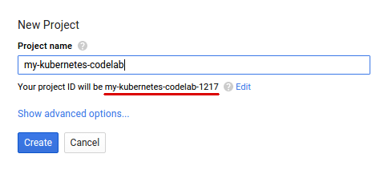
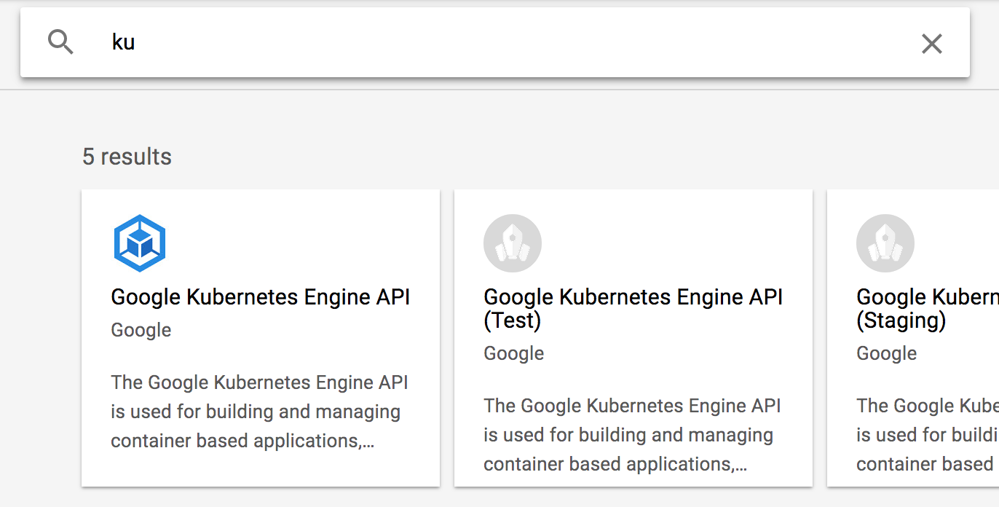
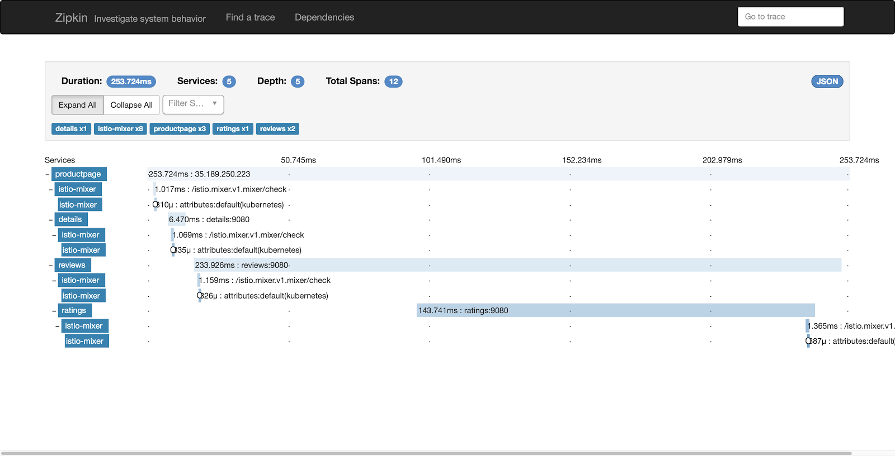
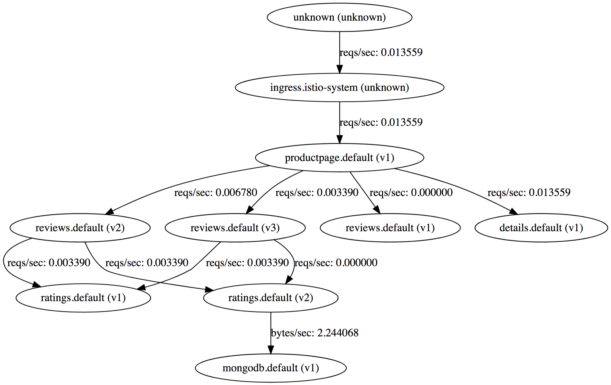

# Istio lab (with Kubernetes)
(estimated duration: 60 minutes)


## Summary 
In this lab, you will learn how to install and configure Istio, an open source framework for connecting, securing, and managing microservices, on Google Kubernetes Engine, Google's hosted Kubernetes product. You will also deploy an Istio-enabled multi-service application.

# Table of Contents
1. [Introduction](#introduction)
2. [Setup and Requirements](#setup-and-requirements)
3. [Prepare your Kubernetes/GKE cluster](#prepare-your-kubernetes-cluster)
4. [Installing Istio](#installing-istio)
5. [Verifying the installation](#verifying-the-installation)
6. [Deploying an application](#deploying-an-application)
7. [Use the application](#use-the-application)
8. [Dynamically change request routing](#dynamically-change-request-routing)
9. [View metrics and tracing](#viewing-metrics-and-tracing)
10. [Monitoring for Istio](#monitoring-for-istio)
11. [Generating a Service Graph](#generate-graph)
12. [Uninstall Istio](#uninstall-istio)
13. [Cleanup resources](#cleanup-resources)
14. [What's next?](#what-next?)


## Introduction <a name="introduction"/>

[Istio](http://istio.io) is an open source framework for connecting, securing, and managing microservices, including services running on Google Kubernetes Engine (GKE). It lets you create a network of deployed services with load balancing, service-to-service authentication, monitoring, and more, without requiring any changes in service code.

You add Istio support to services by deploying a special Envoy sidecar proxy to each of your application&#39;s pods in your environment that intercepts all network communication between microservices, configured and managed using Istio'&#39;'s control plane functionality.

This codelab shows you how to install and configure Istio on Kubernetes Engine, deploy an Istio-enabled multi-service application, and dynamically change request routing.

## Setup and Requirements <a name="setup-and-requirements"/>

If you don&#39;t already have a Google Account (Gmail or Google Apps), you must [create one](https://accounts.google.com/SignUp). Sign-in to Google Cloud Platform console ( [console.cloud.google.com](http://console.cloud.google.com)) and create a new project:
 
 
 

Remember the project ID, a unique name across all Google Cloud projects (the name above has already been taken and will not work for you, sorry!). It will be referred to later in this codelab as PROJECT\_ID.

Next, you&#39;ll need to [enable billing](https://console.cloud.google.com/billing) in the Developers Console in order to use Google Cloud resources.

Running through this codelab shouldn&#39;t cost you more than a few dollars, but it could be more if you decide to use more resources or if you leave them running (see &quot;cleanup&quot; section at the end of this document). Google Kubernetes Engine pricing is documented [here](https://cloud.google.com/kubernetes-engine/docs/#pricing).

New users of Google Cloud Platform are eligible for a [$300 free trial](https://console.developers.google.com/billing/freetrial?hl=en).

### Enable API
Enable the Kubernetes Engine API:
1. First client on APIs and Services on the right pane


2. Check if the Kubernetes APIs are enabled


3. If you **CANNOT** find this in your project, then Kubernetes APIs are not enabled. Proceed further. Otherwise skip the following steps.

4. Click on **ENABLE APIS AND SERVICES**


5. Start typing _**ku**_ in the search bar
 

6. Select _Google Kubernetes Engine API_

7. Enable the API


### Google Cloud Shell
While Google Cloud and Kubernetes can be operated remotely from your laptop, in this codelab we will be using Google Cloud Shell, a command line environment running in the Cloud.

This Debian-based virtual machine is loaded with all the development tools you'll need. It offers a persistent 5GB home directory, and runs on the Google Cloud, greatly enhancing network performance and authentication. This means that all you will need for this codelab is a browser (yes, it works on a Chromebook).

To activate Google Cloud Shell, from the developer console simply click the button on the top right-hand side (it should only take a few moments to provision and connect to the environment):


Then accept the terms of service and click the "Start Cloud Shell" link:


Once connected to the cloud shell, you should see that you are already authenticated and that the project is already set to your _PROJECT_ID_

## Prepare your Kubernetes/GKE cluster <a name="prepare-your-kubernetes-cluster"/>

The requirements for this Istio codelab are as follows:

- your cluster should use Kubernetes 1.8.0 or newer, which includes [role-based access control (RBAC)](https://cloud-dot-devsite.googleplex.com/container-engine/docs/role-based-access-control) support.
- you need to [create your cluster with alpha feature support](https://cloud.google.com/container-engine/docs/alpha-clusters), as Istio makes use of [initializers](https://kubernetes.io/docs/admin/extensible-admission-controllers/#enable-initializers-alpha-feature) to [automatically install the Istio Proxy into every Pod](https://istio.io/docs/setup/kubernetes/sidecar-injection.html#automatic-sidecar-injection)

To create a new cluster that meets these requirements, including alpha features, run the following commands (this assumes that you have correctly set a zone as indicated in the setup) :

```
    gcloud container clusters create hello-istio \
    --machine-type=n1-standard-2 \
    --num-nodes=5 \
    --no-enable-legacy-authorization \
    --cluster-version=1.8.7-gke.0
```

Setup Kubernetes CLI Content:

```gcloud container clusters get-credentials hello-istio --zone ZONE_NAME --project PROJECT_ID```

Now, grant cluster admin permissions to the current user. You need these permissions to create the necessary RBAC rules for Istio.

```
    kubectl create clusterrolebinding cluster-admin-binding \
    --clusterrole=cluster-admin \
    --user=$(gcloud config get-value core/account)
```

If you navigate in the GCP console to Kubernetes clusters you should see a screen similar to this:


## Installing Istio <a name="installing-istio"/>

Now, let&#39;s install Istio. Istio is installed in its own Kubernetes istio-system namespace, and can manage microservices from all other namespaces. The installation includes Istio core components, tools, and samples.

The [Istio release page](https://github.com/istio/istio/releases) offers download artifacts for several OSs. In our case, with CloudShell we&#39;ll be using this command to download and extract the latest release automatically:

```curl -L https://git.io/getLatestIstio | sh -```

The installation directory contains the following:

- Installation .yaml files for Kubernetes in **install/**
- Sample applications in **samples/**
- The istioctl client binary in the **bin/** directory. This tool is used when manually injecting Envoy as a sidecar proxy and for creating routing rules and policies.
- The VERSION configuration file

Change to the istio install directory:

```cd ./istio-* ```

Add the istioctl client to your PATH:

```export PATH=$PWD/bin:$PATH```

Let&#39;s now install Istio&#39;s core components. We will install the Istio Auth components which enable [**mutual TLS authentication**](https://istio.io/docs/concepts/security/mutual-tls.html) between sidecars:

```kubectl apply -f install/kubernetes/istio-auth.yaml```

This creates the istio-system namespace along with the required RBAC permissions, and deploys Istio-Pilot, Istio-Mixer, Istio-Ingress, Istio-Egress, and Istio-CA (Certificate Authority).

## Verifying the installation <a name="verifying-the-installation"/>

First, ensure the following Kubernetes services are deployed: istio-pilot, istio-mixer, istio-ingress, and istio-egress.

Run the command:
```
kubectl get svc -n istio-system
```
OUTPUT:

```
NAME            CLUSTER-IP      EXTERNAL-IP       PORT(S)                       AGE
istio-ingress   10.83.245.171   35.184.245.62     80:32730/TCP,443:30574/TCP    3m
istio-pilot     10.83.251.173   &lt;none&gt;      8080/TCP,8081/TCP             3m
istio-mixer     10.83.244.253   &lt;none&gt;      9091/TCP,9094/TCP,42422/TCP   3m
```

Then make sure that the corresponding Kubernetes pods are deployed and all containers are up and running: istio-pilot-\*, istio-mixer-\*, istio-ingress-\*, istio-ca-\*.

Run the command:
```
kubectl get pods -n istio-system
```
OUTPUT:
```
NAME                                READY     STATUS    RESTARTS   AGE
istio-ca-3657790228-j21b9           1/1       Running   0          3m
istio-ingress-1842462111-j3vcs      1/1       Running   0          3m
istio-pilot-2275554717-93c43        1/1       Running   0          3m
istio-mixer-2104784889-20rm8        2/2       Running   0          3m
```

When all the pods are running, you can proceed.

## Deploying an application <a name="deploying-an-application"/>

Now Istio is installed and verified, you can deploy one of the sample applications provided with the installation — [BookInfo](https://istio.io/docs/guides/bookinfo.html). This is a simple mock bookstore application made up of four services that provide a web product page, book details, reviews (with several versions of the review service), and ratings - all managed using Istio.

You will find the source code and all the other files used in this example in your Istio [samples/bookinfo](https://github.com/istio/istio/tree/master/samples/bookinfo) directory. These steps will deploy the BookInfo application&#39;s services in an Istio-enabled environment, with Envoy sidecar proxies injected alongside each service to provide Istio functionality.

Because we installed the Istio Initializer component, we deploy our application directly using kubectl create and its regular YAML deployment file. The Istio-Initializer automatically injects Envoy containers into your application pods:

```kubectl create -f <(istioctl kube-inject -f samples/bookinfo/kube/bookinfo.yaml)```

Finally, confirm that the application has been deployed correctly by running the following commands:

Run the command:
```
kubectl get services
```
OUTPUT:
```
NAME                       CLUSTER-IP   EXTERNAL-IP   PORT(S)              AGE
details                    10.0.0.31    &lt;none&gt;        9080/TCP             6m
kubernetes                 10.0.0.1     &lt;none&gt;        443/TCP              21m
productpage                10.0.0.120   &lt;none&gt;        9080/TCP             6m
ratings                    10.0.0.15    &lt;none&gt;        9080/TCP             6m
reviews                    10.0.0.170   &lt;none&gt;        9080/TCP             6m
```

Run the command:
```
kubectl get pods
```

OUTPUT:
```
NAME                                        READY     STATUS    RESTARTS   AGE
details-v1-1520924117-48z17                 2/2       Running   0          6m
productpage-v1-560495357-jk1lz              2/2       Running   0          6m
ratings-v1-734492171-rnr5l                  2/2       Running   0          6m
reviews-v1-874083890-f0qf0                  2/2       Running   0          6m
reviews-v2-1343845940-b34q5                 2/2       Running   0          6m
reviews-v3-1813607990-8ch52                 2/2       Running   0          6m
```

## Use the application <a name="use-the-application"/>

Now that it&#39;s deployed, let&#39;s see the BookInfo application in action.

First you need to get the ingress IP and port, as follows:

```
kubectl get ingress -o wide 
NAME      HOSTS     ADDRESS                 PORTS     AGE
gateway   *         130.211.10.121          80        3m
```

Based on this information, set the GATEWAY\_URL environment variable:

```export GATEWAY_URL=130.211.10.121:80```

Once you have the address and port, check that the BookInfo app is running with curl:

Run the command:
```
curl -o /dev/null -s -w "%{http_code}\n" http://${GATEWAY_URL}/productpage
```
OUTPUT:
```
200
```

Then point your browser to _**http://$GATEWAY\_URL/productpage**_ to view the BookInfo web page. If you refresh the page several times, you should see different versions of reviews shown in the product page, presented in a round robin style (red stars, black stars, no stars), since we haven&#39;t yet used Istio to control the version routing


## Dynamically change request routing <a name="dynamically-change-request-routing"/>

The BookInfo sample deploys three versions of the reviews microservice. When you accessed the application several times, you will have noticed that the output sometimes contains star ratings and sometimes it does not. This is because without an explicit default version set, Istio will route requests to all available versions of a service in a random fashion.

We use the istioctl command line tool to control routing, adding a route rule that says all traffic should go to the v1 service. First, confirm there are no route rules installed :

```istioctl get routerules -o yaml```

No Resouces will be found. Now, create the rule (check out the source yaml file it you&#39;d like to understand how rules are specified) :

Run the command:
```
istioctl create -f samples/bookinfo/kube/route-rule-all-v1.yaml -n default
```
OUTPUT:
```
Created config route-rule/default/productpage-default at revision 136126
Created config route-rule/default/reviews-default at revision 136127
Created config route-rule/default/ratings-default at revision 136128
Created config route-rule/default/details-default at revision 136130
```

Look at the rule you&#39;ve just created:

```
istioctl get routerules -o yaml
```

Go back to the Bookinfo application (http://$GATEWAY\_URL/productpage) in your browser. You should see the BookInfo application productpage displayed. Notice that the productpage is displayed with no rating stars since reviews:v1 does not access the ratings service.

To test reviews:v2, but only for a certain user, let&#39;s create this rule:

```
istioctl create -f samples/bookinfo/kube/route-rule-reviews-test-v2.yaml -n default
```

Check out the route-rule-reviews-test-v2.yaml file to see how this rule is specified :

```
$ cat samples/bookinfo/kube/route-rule-reviews-test-v2.yaml
```
OUTPUT:
```
apiVersion: config.istio.io/v1alpha2
kind: RouteRule
metadata:
  name: reviews-test-v2
spec:
  destination:
    name: reviews
  precedence: 2
  match:
    request:
      headers:
        cookie:
          regex: "^(.*?;)?(user=jason)(;.*)?$"
  route:
  - labels:
      version: v2
```

Look at the rule you&#39;ve just created :

```istioctl get routerule reviews-test-v2 -o yaml```

We now have a way to route some requests to use the reviews:v2 service. Can you guess how? (Hint: no passwords are needed) See how the page behaviour changes if you are logged in as no-one, &#39;jason&#39;, or &#39;kylie&#39;.

You can read the [documentation page](https://istio.io/docs/tasks/traffic-management/request-routing.html) for further details on Istio&#39;s request routing.

Once the v2 version has been tested to our satisfaction, we could use Istio to send traffic from all users to v2, optionally in a gradual fashion.

For now, let&#39;s clean up the routing rules:

```
istioctl delete -f samples/bookinfo/kube/route-rule-all-v1.yaml -n default 
istioctl delete -f samples/bookinfo/kube/route-rule-reviews-test-v2.yaml -n default
```

## View metrics and tracing <a name="viewing-metrics-and-tracing"/>

Istio-enabled applications can be configured to collect trace spans using, for instance, the popular Zipkin distributed tracing system. Distributed tracing lets you see the flow of requests a user makes through your system, and Istio&#39;s model allows this regardless of what language/framework/platform you use to build your application.

First, install the Zipkin addon :

```kubectl apply -f install/kubernetes/addons/zipkin.yaml```

Istio is now configured to send request information.

Configure port forwarding :

```kubectl port-forward -n istio-system $(kubectl get pod -n istio-system -l app=zipkin -o jsonpath='{.items[0].metadata.name}') 9411:9411 &```

If you are running on your local machine, open your browser at [http://localhost:9411](http://localhost:9411)

If you are running on Google Cloud Shell, click the &quot;Web Preview&quot; button to open the page.

 

Load the Bookinfo application again (http://$GATEWAY_URL/productpage).

Select a trace from the list, and you will now see something similar to the following:



You can see how long each microservice call took, including the Istio checks.

You can read the [documentation page](https://istio.io/docs/tasks/telemetry/distributed-tracing.html) for further details on Istio&#39;s distributed request tracing.

## Monitoring for Istio <a name="monitoring-for-istio"/>

This task shows you how to setup and use the Istio Dashboard to monitor mesh traffic. As part of this task, you will install the Grafana Istio addon and use the web-based interface for viewing service mesh traffic data.

First, install the Prometheus addon :

```kubectl apply -f install/kubernetes/addons/prometheus.yaml```

Istio is now configured to send monitoring information to Prometheus.

Next, we install the Grafana addon:

```kubectl apply -f install/kubernetes/addons/grafana.yaml```

Grafana will be used to visualize the data prometheus.

Configure port forwarding :

```kubectl -n istio-system port-forward $(kubectl -n istio-system get pod -l app=grafana -o jsonpath='{.items[0].metadata.name}') 3000:3000 &```

If you are running on your local machine, open your browser at [http://localhost:3000](http://localhost:3000)

If you are running on Google Cloud Shell, click the &quot;Web Preview&quot; button to open the page.


Load the Bookinfo application again (http://$GATEWAY_URL/productpage).

Select a trace from the list, and you will now see something similar to the following:

 

## Generating a Service Graph <a name="generate-graph"/>

This task shows you how to generate a graph of services within an Istio mesh. As part of this task, you will install the ServiceGraph addon and use the web-based interface for viewing service graph of the service mesh.

First, install the Service Graph addon :

```kubectl apply -f install/kubernetes/addons/servicegraph.yaml```

Configure port forwarding :

```kubectl -n istio-system port-forward $(kubectl -n istio-system get pod -l app=servicegraph -o jsonpath='{.items[0].metadata.name}') 8088:8088 &```

If you are running on your local machine, open your browser at [http://localhost:8088/dotviz](http://localhost:8088/dotviz)

If you are running on Google Cloud Shell, click the &quot;Web Preview&quot; button to open the page.

 

You will now see something similar to the following:



## Uninstall Istio <a name="uninstall-istio"/>

Here&#39;s how to uninstall Istio.

```
kubectl delete -f samples/bookinfo/kube/bookinfo.yaml 

service &quot;details&quot; deleted
deployment &quot;details-v1&quot; deleted
service &quot;ratings&quot; deleted
deployment &quot;ratings-v1&quot; deleted
service &quot;reviews&quot; deleted
deployment &quot;reviews-v1&quot; deleted
deployment &quot;reviews-v2&quot; deleted
deployment &quot;reviews-v3&quot; deleted
service &quot;productpage&quot; deleted
deployment &quot;productpage-v1&quot; deleted
```
 
```kubectl delete -f install/kubernetes/istio-auth.yaml```

For the current release, uninstalling Istio core components also deletes the RBAC permissions, the istio-system namespace, and hierarchically all resources under it. It is safe to ignore errors for non-existent resources because they may have been deleted hierarchically.

## Cleanup resources <a name="cleanup-resources"/>

Environment: Web

In addition to uninstalling Istio, you should also delete the Kubernetes cluster created in the setup phase (to save on cost and to be a good cloud citizen):

```gcloud container clusters delete hello-istio``` 

The following clusters will be deleted. - [hello-istio] in [us-central1-f]Do you want to continue (Y/n)?  Y
Deleting cluster hello-istio...done.                                                                                                                                                                                         Deleted [https://container.googleapis.com/v1/projects/codelab-test/zones/us-central1-f/clusters/hello-istio].


Of course, you can also delete the entire project but you would lose any billing setup you have done (disabling project billing first is required). Additionally, deleting a project will only stop all billing after the current billing cycle ends.

## What&#39;s next <a name="what-next"/>

The [Istio site](https://istio.io/) contains guides and samples with fully working example uses for Istio that you can experiment with. These include:

- [Intelligent Routing](https://istio.io/docs/guides/intelligent-routing.html): this example shows how to use Istio&#39;s various traffic management capabilities with BookInfo, and is a particularly good next step from this tutorial.
- [In-Depth Telemetry](https://istio.io/docs/guides/telemetry.html): this example demonstrates how to get uniform metrics, logs, and traces across BookInfo&#39;s services using Istio Mixer and the Istio sidecar proxy.
